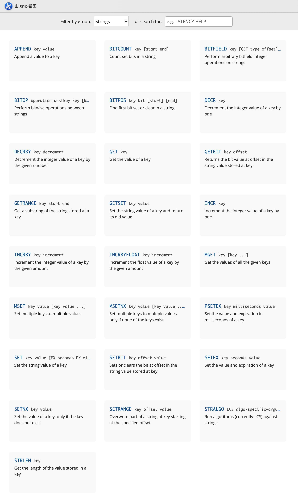
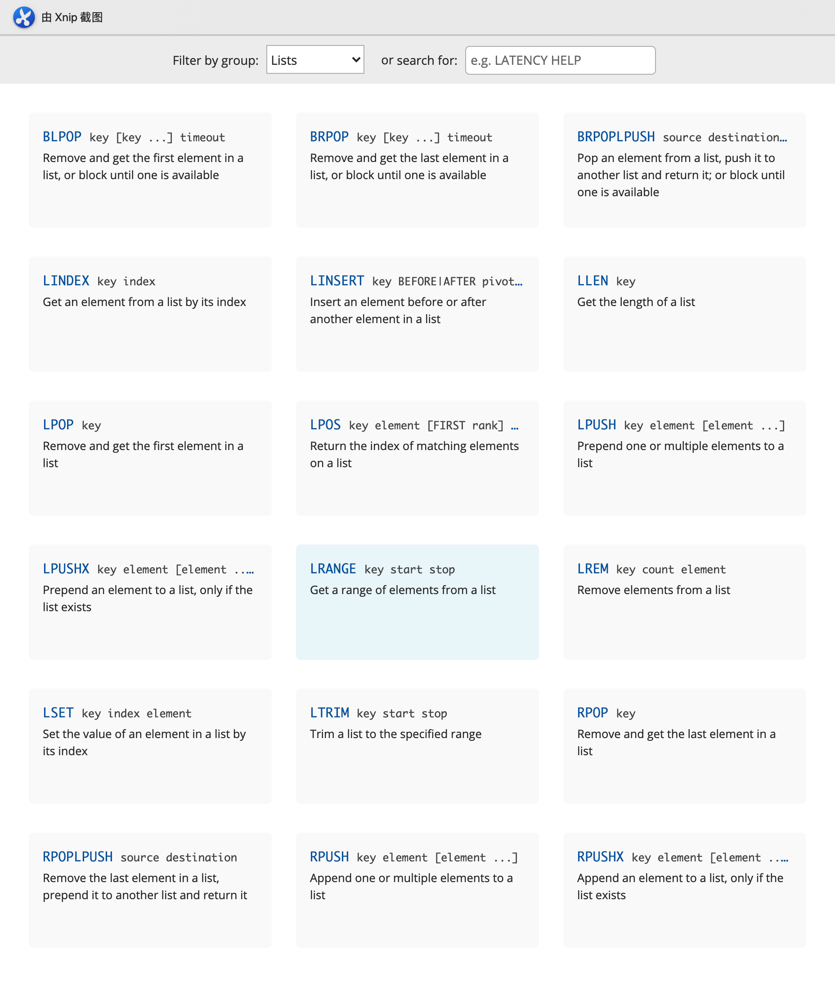
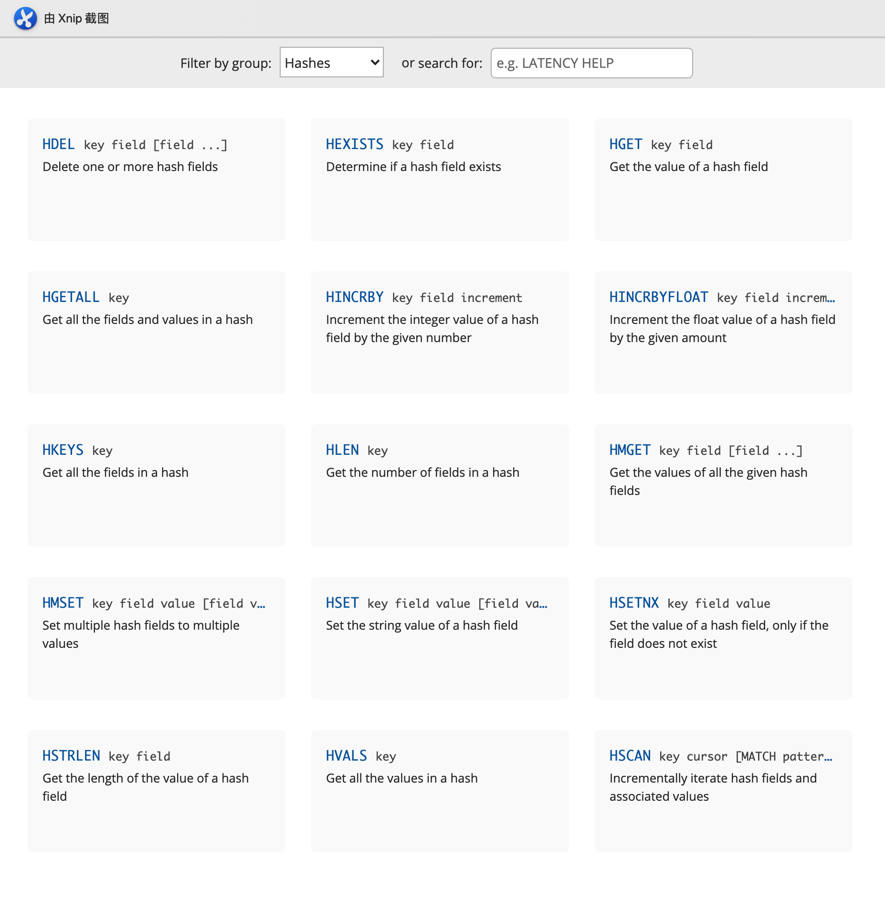
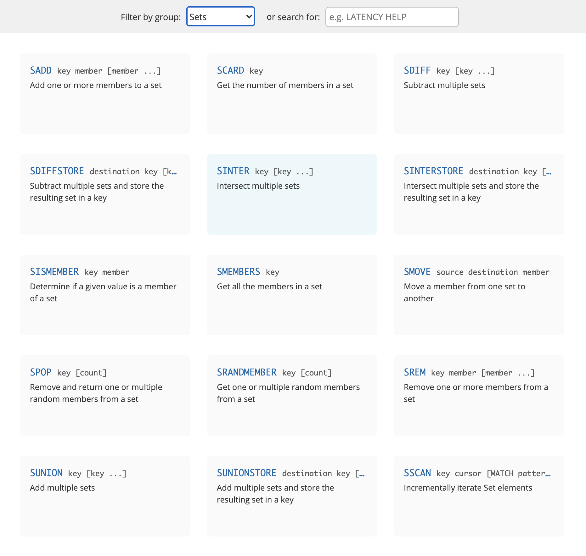

#### 基本操作

```bash
# 1、切换数据库
127.0.0.1:6379> select 1
OK

# 2、查看数据库数据量
127.0.0.1:6379[1]> dbsize
(integer) 0

# 3、插入值
127.0.0.1:6379[1]> set name ligang
OK

# 4、通key获取值
127.0.0.1:6379[1]> get name
"ligang"

# 5、查看当前数据库中所有的key
127.0.0.1:6379[1]> keys *
1) "name"

# 6、清空当前数据库
127.0.0.1:6379[1]> flushdb
OK

# 7、清空所有数据库
127.0.0.1:6379[1]> flushall
OK
```

##### string类型的操作



##### list类型操作



##### hash类型操作



##### set类型操作

