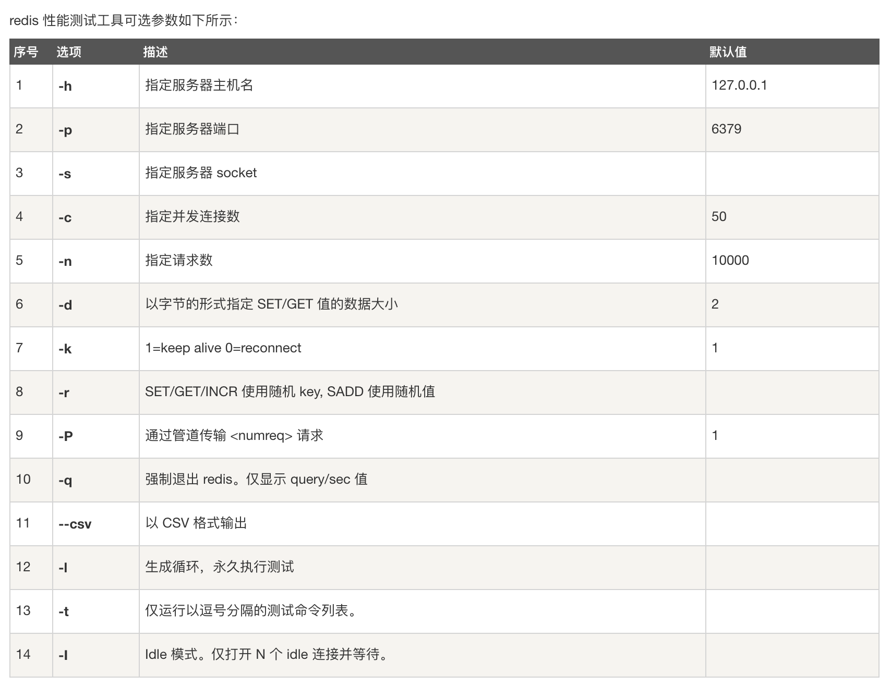

####容器操作命令

##### 帮助命令

```shell
~ % docker version																# 显示docker容器版本
~ % docker info																		# 显示docker的系统信息，包括镜像和容器的数量
~ % docker [command] --help												# 帮助命令
```

##### 镜像命令

###### 查看镜像

```shell
~ % docker images																	# 显示docker所有镜像
# 注释
REPOSITORY																				# 镜像的仓库源
TAG																								# 镜像的版本
IMAGE ID																					# 镜像的ID
CREATED																						# 镜像的创建时间
SIZE																							# 镜像的大小

# 可选项
Options:
  -a, --all             Show all images (default hides intermediate images)
      --digests         Show digests
  -f, --filter filter   Filter output based on conditions provided
      --format string   Pretty-print images using a Go template
      --no-trunc        Don't truncate output
  -q, --quiet           Only show numeric IDs
```

###### 搜索镜像

```shell
~ % docker search [OPTIONS] TERM										# 搜索docker的镜像
# 可选项
Options:
  -f, --filter filter   Filter output based on conditions provided
      --format string   Pretty-print search using a Go template
      --limit int       Max number of search results (default 25)
      --no-trunc        Don't truncate output
```

###### 拉取镜像命令

```shell
# docker pull [OPTIONS] NAME[:TAG|@DIGEST]
~ % docker pull [image name]											# 拉取docker的镜像											
# 可选项
Options:
  -a, --all-tags                Download all tagged images in the repository
      --disable-content-trust   Skip image verification (default true)
  -q, --quiet                   Suppress verbose output
```

###### 删除镜像

```shell
# docker rmi [OPTIONS] IMAGE [IMAGE...]
~ % docker rmi [image name]												# 删除docker的镜像						
# 可选项
Options:
  -f, --force      Force removal of the image
      --no-prune   Do not delete untagged parents
```

##### 容器命令

###### 查看容器命令

```shell
~ % docker ps																			# 查看容器
# 可选项
Options:
  -a, --all             Show all containers (default shows just running)
  -f, --filter filter   Filter output based on conditions provided
      --format string   Pretty-print containers using a Go template
  -n, --last int        Show n last created containers (includes all states) (default -1)
  -l, --latest          Show the latest created container (includes all states)
      --no-trunc        Don't truncate output
  -q, --quiet           Only display numeric IDs
  -s, --size            Display total file sizes
```

###### 创建容器

```shell
# docker run [OPTIONS] IMAGE [COMMAND] [ARG...]
~ % docker run [image name]												# 创建容器
# 可选项
Options:
      --add-host list                  Add a custom host-to-IP mapping (host:ip)
  -a, --attach list                    Attach to STDIN, STDOUT or STDERR
      --blkio-weight uint16            Block IO (relative weight), between 10 and 1000, or 0 to disable (default 0)
      --blkio-weight-device list       Block IO weight (relative device weight) (default [])
      --cap-add list                   Add Linux capabilities
      --cap-drop list                  Drop Linux capabilities
      --cgroup-parent string           Optional parent cgroup for the container
      --cidfile string                 Write the container ID to the file
      --cpu-period int                 Limit CPU CFS (Completely Fair Scheduler) period
      --cpu-quota int                  Limit CPU CFS (Completely Fair Scheduler) quota
      --cpu-rt-period int              Limit CPU real-time period in microseconds
      --cpu-rt-runtime int             Limit CPU real-time runtime in microseconds
  -c, --cpu-shares int                 CPU shares (relative weight)
      --cpus decimal                   Number of CPUs
      --cpuset-cpus string             CPUs in which to allow execution (0-3, 0,1)
      --cpuset-mems string             MEMs in which to allow execution (0-3, 0,1)
  -d, --detach                         Run container in background and print container ID
      --detach-keys string             Override the key sequence for detaching a container
      --device list                    Add a host device to the container
      --device-cgroup-rule list        Add a rule to the cgroup allowed devices list
      --device-read-bps list           Limit read rate (bytes per second) from a device (default [])
      --device-read-iops list          Limit read rate (IO per second) from a device (default [])
      --device-write-bps list          Limit write rate (bytes per second) to a device (default [])
      --device-write-iops list         Limit write rate (IO per second) to a device (default [])
      --disable-content-trust          Skip image verification (default true)
      --dns list                       Set custom DNS servers
      --dns-option list                Set DNS options
      --dns-search list                Set custom DNS search domains
      --domainname string              Container NIS domain name
      --entrypoint string              Overwrite the default ENTRYPOINT of the image
  -e, --env list                       Set environment variables
      --env-file list                  Read in a file of environment variables
      --expose list                    Expose a port or a range of ports
      --gpus gpu-request               GPU devices to add to the container ('all' to pass all GPUs)
      --group-add list                 Add additional groups to join
      --health-cmd string              Command to run to check health
      --health-interval duration       Time between running the check (ms|s|m|h) (default 0s)
      --health-retries int             Consecutive failures needed to report unhealthy
      --health-start-period duration   Start period for the container to initialize before starting health-retries countdown (ms|s|m|h) (default 0s)
      --health-timeout duration        Maximum time to allow one check to run (ms|s|m|h) (default 0s)
      --help                           Print usage
  -h, --hostname string                Container host name
      --init                           Run an init inside the container that forwards signals and reaps processes
  -i, --interactive                    Keep STDIN open even if not attached
      --ip string                      IPv4 address (e.g., 172.30.100.104)
      --ip6 string                     IPv6 address (e.g., 2001:db8::33)
      --ipc string                     IPC mode to use
      --isolation string               Container isolation technology
      --kernel-memory bytes            Kernel memory limit
  -l, --label list                     Set meta data on a container
      --label-file list                Read in a line delimited file of labels
      --link list                      Add link to another container
      --link-local-ip list             Container IPv4/IPv6 link-local addresses
      --log-driver string              Logging driver for the container
      --log-opt list                   Log driver options
      --mac-address string             Container MAC address (e.g., 92:d0:c6:0a:29:33)
  -m, --memory bytes                   Memory limit
      --memory-reservation bytes       Memory soft limit
      --memory-swap bytes              Swap limit equal to memory plus swap: '-1' to enable unlimited swap
      --memory-swappiness int          Tune container memory swappiness (0 to 100) (default -1)
      --mount mount                    Attach a filesystem mount to the container
      --name string                    Assign a name to the container
      --network network                Connect a container to a network
      --network-alias list             Add network-scoped alias for the container
      --no-healthcheck                 Disable any container-specified HEALTHCHECK
      --oom-kill-disable               Disable OOM Killer
      --oom-score-adj int              Tune host's OOM preferences (-1000 to 1000)
      --pid string                     PID namespace to use
      --pids-limit int                 Tune container pids limit (set -1 for unlimited)
      --privileged                     Give extended privileges to this container
  -p, --publish list                   Publish a container's port(s) to the host
  -P, --publish-all                    Publish all exposed ports to random ports
      --read-only                      Mount the container's root filesystem as read only
      --restart string                 Restart policy to apply when a container exits (default "no")
      --rm                             Automatically remove the container when it exits
      --runtime string                 Runtime to use for this container
      --security-opt list              Security Options
      --shm-size bytes                 Size of /dev/shm
      --sig-proxy                      Proxy received signals to the process (default true)
      --stop-signal string             Signal to stop a container (default "SIGTERM")
      --stop-timeout int               Timeout (in seconds) to stop a container
      --storage-opt list               Storage driver options for the container
      --sysctl map                     Sysctl options (default map[])
      --tmpfs list                     Mount a tmpfs directory
  -t, --tty                            Allocate a pseudo-TTY
      --ulimit ulimit                  Ulimit options (default [])
  -u, --user string                    Username or UID (format: <name|uid>[:<group|gid>])
      --userns string                  User namespace to use
      --uts string                     UTS namespace to use
  -v, --volume list                    Bind mount a volume
      --volume-driver string           Optional volume driver for the container
      --volumes-from list              Mount volumes from the specified container(s)
  -w, --workdir string                 Working directory inside the container
```

###### 删除容器

```shell
# docker rm [OPTIONS] CONTAINER [CONTAINER...]
~ % docker rm [container name]										# 删除容器
~ % docker rm -f [container name]									# 删除运行中的容器
# 可选项
Options:
  -f, --force     Force the removal of a running container (uses SIGKILL)
  -l, --link      Remove the specified link
  -v, --volumes   Remove anonymous volumes associated with the container
```

###### 启动容器

```shell
~ % docker start [container id]										# 启动容器
~ % docker restart [container id]									# 重启容器
~ % docker stop [container id]										# 停止容器


~ % docker inspect [container name]								# 查看docker容器元数据

# 显示日志
-tf																								# 显示日志
--tail																						# 显示日志数量
~ % docker logs -tf --tail 200 [container name]		# 打印docker容器日志

```

##### 其他常用命令

```shell
# 以root权限进入容器
# 方法一
~ % docker exec -it --user root dev-oracle /bin/bash
# 方法二
~ % docker attach [container id]

# 拷贝docker容器中的文件
# docker cp [OPTIONS] CONTAINER:SRC_PATH DEST_PATH|-
# docker cp [OPTIONS] SRC_PATH|- CONTAINER:DEST_PATH
~ % docker cp [container id]/[filepath] /[target path]

# 创建文件
~ % mkdir xxx.xx

```


#### 软件安装命令

#### Nginx

##### 安装

###### 步骤一：拉取镜像

```
~ % docker pull nginx
```

###### 步骤二：创建容器

```shell
# 方法一
~ % docker run -d -p 9870:80 --name dev-nginx -v /Users/ligang/devtools/docker/nginx/conf/nginx.conf:/etc/nginx/nginx.conf:ro nginx:1.18.0

# 方法二
~ % docker run -d -p 9870:80 --name dev-nginx -v /Users/ligang/devtools/docker/nginx/conf/nginx.conf:/etc/nginx/nginx.conf:ro -v /Users/ligang/devtools/docker/nginx/content:/usr/share/nginx/html:ro -v /Users/ligang/devtools/docker/nginx/cache:/var/cache/nginx -v /Users/ligang/devtools/docker/nginx/logs:/var/log/nginx nginx:1.18.0
```


##### ELASTIC (ELK) STACK：Elasticsearch

#### 安装

###### 步骤一：拉取镜像
```shell
~ % docker pull elasticsearch:7.6.2
```

###### 步骤二：创建容器

```shell
# 方法1
~ % docker run -p 9200:9200 -p 9300:9300 --name dev-elk -e "discovery.type=single-node" -e "cluster.name=elasticsearch" -v /Users/ligang/devtools/docker/elk/elasticsearch/plugins:/usr/share/elasticsearch/plugins -v /Users/ligang/devtools/docker/elk/elasticsearch/data:/usr/share/elasticsearch/data -d elasticsearch:7.6.2 

# 方法2 官方版
~ % docker run -d --name elasticsearch --net somenetwork -p 9200:9200 -p 9300:9300 -e "discovery.type=single-node" elasticsearch:tag
```

###### 步骤三：安装插件

```shell
# 安装插件
# 1、进入容器
~ % docker exec -it contain-id /bin/bash
# 2、安装插件
~ % ./bin/elasticsearch-plugin install analysis-icu(插件名称)
```


#### ELASTIC (ELK) STACK：Kibana

#### 安装

```shell
# 方法一 官方
~ % $ docker run -d --name kibana --net somenetwork -p 5601:5601 kibana:tag

# 方法二 详细配置安装
~ % docker run -d --name dev-kibana -p 5601:5601 --restart=always --log-driver json-file --log-opt max-size=100m --log-opt max-file=2 -v /Users/ligang/devtools/docker/elk/kibana/config/kibana.yml:/usr/share/kibana/config/kibana.yml kibana:7.6.2
```


#### Apache RocketMQ

##### 安装

###### 步骤一：拉取镜像

```shell
～ % docker pull apacherocketmq/rocketmq
```

###### 步骤二：创建容器

```shell
# 步骤一：创建mqnamesrv
～ % docker run -d -p 9876:9876 -v /Users/ligang/devtools/docker/rocketmq/data/namesrv/logs:/root/logs -v /Users/ligang/devtools/docker/rocketmq/data/namesrv/store:/root/store --name rmqnamesrv -e "MAX_POSSIBLE_HEAP=100000000" apacherocketmq/rocketmq:4.5.0 sh mqnamesrv

# 步骤二：创建broker
～ % docker run -d -p 10911:10911 -p 10909:10909 -v /Users/ligang/devtools/docker/rocketmq/data/broker/logs:/root/logs -v /Users/ligang/devtools/docker/rocketmq/data/broker/store:/root/store -v /Users/ligang/devtools/docker/rocketmq/data/broker/conf/broker.conf:/home/rocketmq/rocketmq-4.5.0/conf/broker.conf --name rmqbroker --link rmqnamesrv:namesrv -e "NAMESRV_ADDR=namesrv:9876" -e "MAX_POSSIBLE_HEAP=200000000" apacherocketmq/rocketmq:4.5.0 sh mqbroker


```


#### Spring Cloud Alibaba

##### 安装

###### 步骤一：拉取容器

```shell
# 拉取容器：
～ % docker pull nacos/nacos-server
```

###### 步骤二：创建容器

```shell
# 创建容器：
# 标准版
～ % docker run --env MODE=standalone --name dev-nacos -d -p 8848:8848 nacos/nacos-server

# 详细版
~ % docker  run \
--name dev-nacos -d \
-p 8848:8848 \
--privileged=true \
--restart=always \
-e JVM_XMS=256m \
-e JVM_XMX=256m \
-e MODE=standalone \
-e PREFER_HOST_MODE=hostname \
-v /Users/ligang/devtools/docker/nacos/logs:/home/nacos/logs \
nacos/nacos-server:1.2.1
```

更新时间：2020-03-21


#### PostgreSQL

##### 安装

###### 步骤一：拉取镜像

```shell
~ % docker pull postgres
```

###### 步骤二：创建容器

```shell
~ % docker run -d \
    --name dev-postgres \
    -e POSTGRES_PASSWORD=123456 \
    -e PGDATA=/var/lib/postgresql/data/pgdata \
    -v /Users/ligang/devtools/docker/postgres:/var/lib/postgresql/data \
    -p 5432:5432 \
    postgres
```

更新时间：2020-03-21


#### RabbitMQ

##### 安装

###### 步骤一：拉取镜像

```shell
# 无管理界面
~ % docker pull rabbitmq

# 有管理界面
~ % docker pull rabbitmq:management
```

###### 步骤二：创建容器

```shell
# 无管理界面
~ % docker run -d --hostname my-rabbit --name dev-rabbit -p 5672:5672 -p 15672:15672 -v /Users/ligang/devtools/docker/rabbitmq:/var/lib/rabbitmq -e RABBITMQ_DEFAULT_VHOST=my_vhost -e RABBITMQ_DEFAULT_USER=admin -e RABBITMQ_DEFAULT_PASS=123456 rabbitmq:latest

# 有管理界面
~ % docker run -d --hostname my-rabbit --name dev-rabbit -p 5672:5672 -p 15672:15672 -v /Users/ligang/devtools/docker/rabbitmq:/var/lib/rabbitmq -e RABBITMQ_DEFAULT_VHOST=my_vhost -e RABBITMQ_DEFAULT_USER=admin -e RABBITMQ_DEFAULT_PASS=123456 rabbitmq:3.8.4-management
```

更新时间：2020-03-21


#### Oracle Database

##### 安装

###### 步骤一：拉取镜像

```shell
# 拉取image：
~ % docker pull store/oracle/database-enterprise:12.2.0.1
```

###### 步骤二：创建容器

```shell
# 第一种创建oracle容器的方法：
~ % docker login
~ % docker run -d -it --name dev-oracle -p 1521:1521 -p 5500:5500  -v /Users/ligang/devtools/docker/oracle/data:/ORCL --env-file /Users/ligang/devtools/docker/oracle/env/env.dat store/oracle/database-enterprise:12.2.0.1

# 第二种创建oracle容器的方法(已经连接成功)：
~ % docker login
~ % docker run -d -it --name dev-oracle -p 1521:1521 -p 5500:5500 -v /Users/ligang/devtools/docker/oracle/data:/ORCL store/oracle/database-enterprise:12.2.0.1

# oracle 默认密码： Oradoc_db1
```

###### 步骤三：进入容器创建存放表空间文件的文件夹

```shell
# 进入oracle容器的方法
# 进入容器并连接数据库
~ % docker exec -it dev-oracle bash -c "source /home/oracle/.bashrc; sqlplus /nolog"
# ~ % sqlplus sys/Oradoc_db1@ORCLCDB as sysdba
# 以root权限进入容器
~ % docker exec -it --user root dev-oracle /bin/bash
~ % docker exec -it --user oracle dev-oracle /bin/bash

# 创建表空间存放路径
[root@a3b2f1adcd02 /]# mkdir -p /home/oracle/data/retail
# 给oracle用户赋权，以便创建表空间文件
[root@a3b2f1adcd02 /]# chown -R oracle:oinstall /home/oracle/data/retail/

# 配置环境
[root@5b410880417d /]# vi /etc/profile
# 加在配置文件最后
export ORACLE_HOME=/home/oracle/app/oracle/product/12.2.0.1/dbhome_2
export ORACLE_SID=ORCLCDB
export PATH=$ORACLE_HOME/bin:$PATH
# 软件连接
[root@a3b2f1adcd02 /]#  ln -s $ORACLE_HOME/bin/sqlplus /usr/bin
```

###### 步骤四：创建表空间以及用户

```sql
# 连接数据库
SQL> conn / as sysdba;
# 修改用户密码
SQL> alter user system identified by 123456;
SQL> alter user sys identified by 123456;
SQL> ALTER PROFILE DEFAULT LIMIT PASSWORD_LIFE_TIME UNLIMITED;

# 查看所有表空间
SQL> select tablespace_name,status,contents from user_tablespaces; 
SQL> alter session set container=cdb$root;

SQL> alter session set container=ORCLPDB1;

# 创建表空间
SQL> create tablespace retail datafile '/u02/app/oracle/oradata/ORCL/temp02.dbf'  size 200M autoextend on next 50M;
SQL> create tablespace retail datafile '/home/oracle/data/cdb/retail.dbf' size 200M autoextend on next 50M;
SQL> create tablespace retail datafile '/home/oracle/data/pdb/retail.dbf' size 200M autoextend on next 50M;

SQL> create tablespace retail datafile '/home/oracle/data/retail/retail.dbf' size 10M autoextend on maxsize 1G;

# 在表空间上创建用户
create user c##retail identified by 123456 default tablespace RETAIL temporary tablespace TEMP;
# 第一种创建用户的方法
SQL> create user retail identified by 123456 default tablespace retail;
# 第二种创建用户的方法 cdb下
SQL> create user c##retail identified by 123456 default tablespace retail;

# 修改密码
SQL> alter user retail identified by 123456;

# 删除用户
SQL> DROP USER retail CASCADE;

# 给新建的用户赋权
SQL> grant connect,resource,dba to C##RETAIL;

# delete tablespace
SQL> drop tablespace retail including contents and datafiles

-- 1 查看系统中的容器：
--    select con_id,dbid,NAME,OPEN_MODE from v$pdbs;
-- 2 先打开pdb容器：
--    alter pluggable database ORCLPDB1 open;
-- 3再查看容器，pdb应该是READ，WRITE：
--    select con_id,dbid,NAME,OPEN_MODE from v$pdbs;
-- 4切换容器：
--    alter session set container=ORCLPDB1;
-- 5查看当前使用的容器
--    select sys_context ('USERENV', 'CON_NAME') from dual;
-- create tablespace retail 
-- datafile '/u02/app/oracle/oradata/ORCL/retail.dbf' 
-- size 50M 
-- autoextend on next 50m maxsize 2048m 
-- extent management local;
-- 
-- create temporary tablespace retail_temp
-- tempfile '/u02/app/oracle/oradata/ORCL/retail_temp.dbf'
-- size 32m
-- autoextend on next 32m maxsize 1024m
-- extent management local;

create user henfengyu identified by 123456 default tablespace retail
temporary tablespace retail_temp;

grant connect,resource to henfengyu;
grant dba to henfengyu;

alter user henfengyu account unlock identified by 123456;
```

更新时间：2020-03-21


#### MySQL

##### 安装

###### 步骤一：拉取镜像

```shell
~ % docker pull mysql
```

###### 步骤二：创建容器

```shell
# 第一种
~ % docker run -d -v /Users/ligang/devtools/docker/mysql/:/var/lib/mysql -p 3306:3306 --name dev-mysql -e MYSQL_ROOT_PASSWORD=123456 docker.io/mysql

# 第二种（查询忽略表名大小写）
#~ % docker run --name dev-mysql -v /Users/ligang/devtools/docker/mysql:/var/lib/mysql -p 3306:3306 -e #MYSQL_ROOT_PASSWORD=123456 -d docker.io/mysql --lower_case_table_names=1
~ % docker run --name dev-mysql -p 3306:3306 -e MYSQL_ROOT_PASSWORD=123456 -d -v /Users/ligang/devtools/docker/mysql/data:/var/lib/mysql mysql:8.0.20 --character-set-server=utf8mb4 --collation-server=utf8mb4_unicode_ci --lower_case_table_names=1

~ % docker run --name dev-mysql-5nd -v /Users/ligang/devtools/docker/mysql_5nd:/var/lib/mysql -p 3306:3306 -e MYSQL_ROOT_PASSWORD=123456 -d docker.io/mysql:5.7.28 --lower_case_table_names=1

# 第三种（设置字符集为utf8mb4）
# 1
~ % docker run -p 3306:3306 --name dev-mysql -v /Users/ligang/devtools/docker/mysql:/var/lib/mysql -e MYSQL_ROOT_PASSWORD=123456 -d docker.io/mysql --lower_case_table_names=1 --character-set-server=utf8mb4 --collation-server=utf8mb4_unicode_ci
# 2 配置文件
~ % docker run --name dev-mysql -v /Users/ligang/devtools/docker/mysql/data:/var/lib/mysql -v /Users/ligang/devtools/docker/mysql/custom:/etc/mysql/conf.d -p 3306:3306 -e MYSQL_ROOT_PASSWORD=123456 -d mysql:8.0.20 --character-set-server=utf8mb4 --collation-server=utf8mb4_unicode_ci
```

> -p 3306:3306->把容器的mysql端口3306映射到宿主机的3306端口，这样想访问mysql就可以直接访问宿主机的3306端口。
>
> -v /opt/data/mysql:/var/lib/mysql->把宿主机/opt/data/mysql/目录映射到容器的/var/lib/mysql目录

更新时间：2019-03-21


#### Redis

##### 安装

###### 步骤一：拉取镜像

```shell
~ % docker pull redis
```

###### 步骤二：创建容器

```shell
~ % # 创建redis容器，并设置密码
~ % docker run --name dev-redis -d -p 6379:6379 -v /Users/ligang/devtools/docker/redis/data:/data redis:latest redis-server --appendonly yes --requirepass "123456"

# 创建redis容器，并挂载配置文件
~ % docker run --name dev-redis -d -p 6379:6379 -v /Users/ligang/devtools/docker/redis/data:/data -v /Users/ligang/devtools/docker/redis/conf/redis.conf:/etc/redis/redis.conf redis:6.0.5 redis-server --requirepass "123456"

# 进入redis容器，并且启动redis-cli
# 方法1
~ % docker exec -it [container name] or [container id] redis-cli -h 192.168.74.128 -p 6379
# 方法2
~ % docker exec -it [container name] or [container id] redis-cli


# 连接设置了密码的redis-server
127.0.0.1:6379> auth password
```

##### 测试

###### 测试命令

```shell
# 测试redis单机并发量
# 1、进入redis容器
~ % docker exec -it [container name] or [container id] /bin/bash
# 2、进入"/usr/local/bin"目录下
root@75e2c66b02df: cd /usr/local/bin
# 3、运行测试命令
# -h: 指定服务器主机名，-p: 端口号，-c: 
root@75e2c66b02df:/usr/local/bin# redis-benchmark  -h localhost -p 6379 -c 100 -n 10000
```

【截图来自菜鸟教程】



###### 

#### MongoDB

##### 安装

###### 步骤一：拉取镜像

```
~ % docker pull mongo
```

###### 步骤二：创建容器

```shell
~ % docker run --name dev-mongo -p 27017:27017 -v /Users/ligang/devtools/docker/mongo/data/configdb:/data/configdb/ -v /Users/ligang/devtools/docker/mongo/data/db/:/data/db/ -d mongo --auth

# 挂载配置文件：-v /Users/ligang/devtools/docker/mongo/data/configdb:/data/configdb/
# 挂载数据文件：-v /Users/ligang/devtools/docker/mongo/data/db/:/data/db/
# 设置mongo需要登陆验证：--auth
```

###### 步骤三：创建mongo用户

```shell
# 进入mongo容器
~ % docker exec -it [container name] or [container id] mongo admin

# 创建数据库及账号
> db.createUser({ user: 'admin', pwd: '123456', roles: [ { role: "userAdminAnyDatabase", db: "admin" } ] });

```

更新时间：2019-03-21


#### Apache ZooKeeper

##### 安装

###### 步骤一：拉取镜像

```shell
~ % docker pull zookeeper
```

###### 步骤二：创建容器

```shell
~ % docker run -d -p 2181:2181 -v /Users/ligang/devtools/docker/zookeeper/data/:/data/ --name=learn-zookeeper --privileged zookeeper
```

###### 步骤三：执行进程

```shell
~ % docker exec -it [container id] /bin/bash 
# 进入docker的zookeeper容器，找到zkCli.sh，执行./zkCli.sh
```

更新时间：2019-03-21