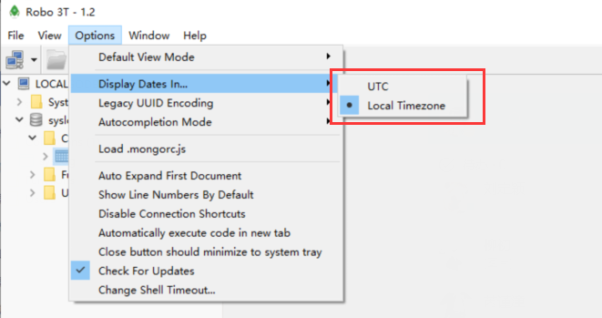

#### MongoDB

##### 安装

###### 步骤一：拉取镜像

    ~ % docker pull mongo

###### 步骤二：创建容器

```shell
~ % docker run --name mongo -p 27017:27017 \
	-v $PWD/devtools/docker/mongo/data/configdb:/data/configdb/ \
	-v $PWD/devtools/docker/mongo/data/db/:/data/db/ \
	-d mongo:5.0.3 --auth

# -e MONGO_INITDB_ROOT_USERNAME=mongoadmin \
#  -e MONGO_INITDB_ROOT_PASSWORD=123456 \
# 挂载配置文件：-v $PWD/devtools/docker/mongo/data/configdb:/data/configdb/
# 挂载数据文件：-v $PWD/devtools/docker/mongo/data/db/:/data/db/
# 设置mongo需要登陆验证：--auth
	docker run -d \
		--name mongo \
		-p 27017:27017 \
		-v /home/software/docker/mongo/data/configdb:/data/configdb/ \
		-v /home/software/docker/mongo/data/db/:/data/db/ \
		mongo:5.0.6
```

###### 步骤三：创建 mongo 用户

```shell
# 第一步：进入mongo容器
~ % docker exec -it [container name] or [container id] mongo admin
docker exec -it mongo mongo

# 第二步：选择admin数据库
> use admin

# 第三步：创建超级管理员账号
> db.createUser({user: "admin", pwd: "123456", roles: [{ role: "userAdminAnyDatabase", db: "admin" }]})

# 第四步：认证创建的用户,返回`1`表示认证成功
> db.auth('admin', '123456')

# 第五步：查看认证效果
> show dbs
# 效果：
# admin 0.000GB
# config 0.000GB
# local 0.000GB
db.createUser({user: "user",pwd: "password",roles: [ { role: "readWrite", db: "microservices" } ]} )

db.auth('user','password')


```

###### 步骤四：创建工作库

```shell
MongoDB的用户权限和数据库是绑定的。也就是创建一个新的数据库，并在数据库中插入数据的正确操作应该是需要创建与之对应的用户，下面退出MongoDB命令行模式，重新进入：

# 1. 进入`admin`数据库，`root`用户需要在`admin`数据库中认证。
> use admin

# 2. 超级用户进行认证
> db.auth('root','123456')

# 3. 输入创建`simple`用户，并为它指定数据库为`simple_log`。
> db.createUser({user: "book",pwd: "123456",roles: [ { role: "readWrite", db: "book-mgr" } ]} )

# 4. 输入切换认证用户。
> db.auth('book','123456')

# 5. 切换至`recommended`数据库
> use recommended

# 6. 创建一条数据。
> db.repo.insert({"name":"simple"})
```

更新时间：2021-05-14

#### **2018-12-19 10:05**

#### 问题：数据库时间显示有时差

##### 解决方案：

###### 1、代码修改

```java
// 默认时间为格林威治时间，通过注解，修改时差 - "GMT+8"
@DateTimeFormat(pattern = "yyyy-MM-dd HH:mm:ss")
@JsonFormat(pattern = "yyyy-MM-dd HH:mm:ss", timezone = "GMT+8")
private LocalDateTime time = LocalDateTime.now();
```

###### 2、有可能是可视化工具的问题，可视化工具设置显示本地时间


