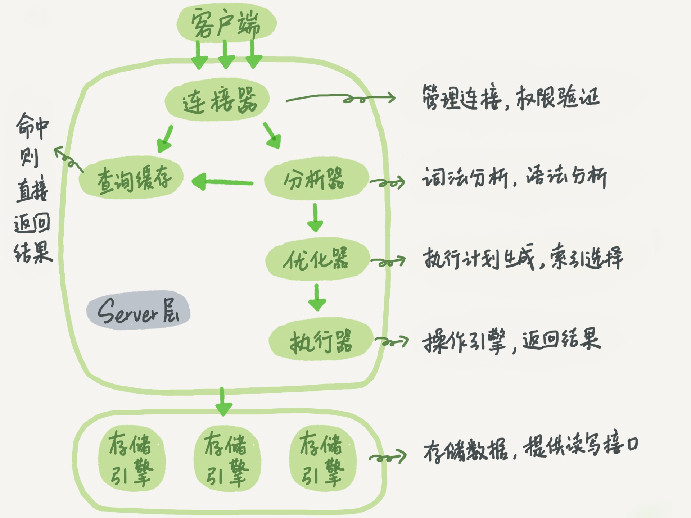

#### 优化器追踪示例 

```shell
# 1.查看优化器状态
show variables like 'optimizer_trace';

# 2.会话级别临时开启
set session optimizer_trace="enabled=on",end_markers_in_json=on;

# 3.设置优化器追踪的内存大小
set OPTIMIZER_TRACE_MAX_MEM_SIZE=1000000;

# 4.执行自己的SQL
select host,user,plugin from user;

# 5.information_schema.optimizer_trace表
SELECT trace FROM information_schema.OPTIMIZER_TRACE;

# 6.导入到一个命名为xx.trace的文件，然后用JSON阅读器来查看（如果没有控制台权限，或直接交由运维，让他把该 trace 文件，输出给你就行了。 ）。
SELECT TRACE INTO DUMPFILE "E:\\test.trace" FROM INFORMATION_SCHEMA.OPTIMIZER_TRACE;
```

###### **注意：不设置优化器最大容量的话，可能会导致优化器返回的结果不全。**


#### MySQL

##### 安装

###### 步骤一：拉取镜像

```shell
~ % docker pull mysql
```

###### 步骤二：创建容器

```shell
# 第一种
~ % docker run -d -v $PWD/devtools/docker/mysql/:/var/lib/mysql -p 3306:3306 --name dev-mysql -e MYSQL_ROOT_PASSWORD=123456 docker.io/mysql

# 第二种（查询忽略表名大小写）
~ % docker run -p 3306:3306 --name mysql \
	-v $PWD/devtools/docker/mysql/custom:/etc/mysql/conf.d \
	-v $PWD/devtools/docker/mysql/datadir:/var/lib/mysql \
	-e MYSQL_ROOT_PASSWORD=123456 \
	-e TZ=Asia/Shanghai \
	-d mysql:8.0.28 --character-set-server=utf8mb4 --collation-server=utf8mb4_unicode_ci
	
docker run -d \
		-p 3306:3306 \
		--name mysql \
		-v /home/software/docker/mysql/custom:/etc/mysql/conf.d \
		-v /home/software/docker/mysql/datadir:/var/lib/mysql \
		-e MYSQL_ROOT_PASSWORD=123456 \
		-e TZ=Asia/Shanghai \
		mysql:8.0.28 --character-set-server=utf8mb4 --collation-server=utf8mb4_unicode_ci
```

> -p 3306:3306->把容器的 mysql 端口 3306 映射到宿主机的 3306 端口，这样想访问 mysql 就可以直接访问宿主机的 3306 端口。
>
> -v /opt/data/mysql:/var/lib/mysql->把宿主机/opt/data/mysql/目录映射到容器的/var/lib/mysql 目录

更新时间：2019-03-21

#### MySQL 乐观锁

```

```

#### SQL 查询语句的执行步骤



图片来自于：极客时间-MySQL 实战 45 讲

#### 多表查询修改

```
update tableA a
left join tableB b on
    a.name_a = b.name_b
set
    validation_check = if(start_dts > end_dts, 'VALID', ''
```

#### 基本操作

```
/* windows 服务 */
-- 启动mysql
	net start mysql
-- 创建windows服务
	sc create mysql binPath = mysql_bin_path(注意：等号与值之间有空格)
/* 链接与断开服务器 */
mysql -h 地址 -p 端口 -u 用户名 -p 密码
SHOW PROCESSLIST -- 显示哪些线程正在运行
SHOW VARIABLES -- 显示系统变量信息
```

#### 数据库操作

```
/* 数据库操作 */
-- 查看当前数据库
	select database();
-- 显示当前时间、用户名、数据库版本
	select now(), user(), version();
-- 创建库
	create database[if not exists] 数据库名 数据库选项
        数据库选项：
            CHARACTER SET charset_name
            COLLATE collation_name
-- 查看已有库
    SHOW DATABASES[ LIKE 'PATTERN']
-- 查看当前库信息
    SHOW CREATE DATABASE 数据库名
-- 修改库的选项信息
    ALTER DATABASE 库名 选项信息
-- 删除库
    DROP DATABASE[ IF EXISTS] 数据库名
		同时删除该数据库相关的目录及其目录内容
```

#### 表的操作

###### mysql查询表内所有字段名和备注

```sql
SELECT DISTINCT
	column_name AS 字段名,
	column_comment AS 字段备注 
FROM
	information_schema.COLUMNS 
WHERE
	table_name = 'fans';
```

