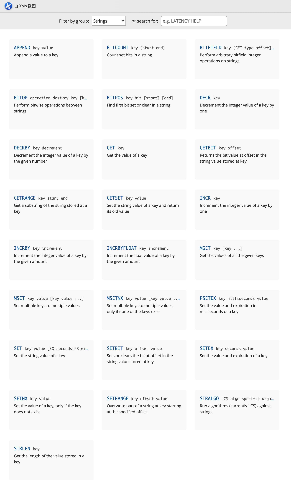
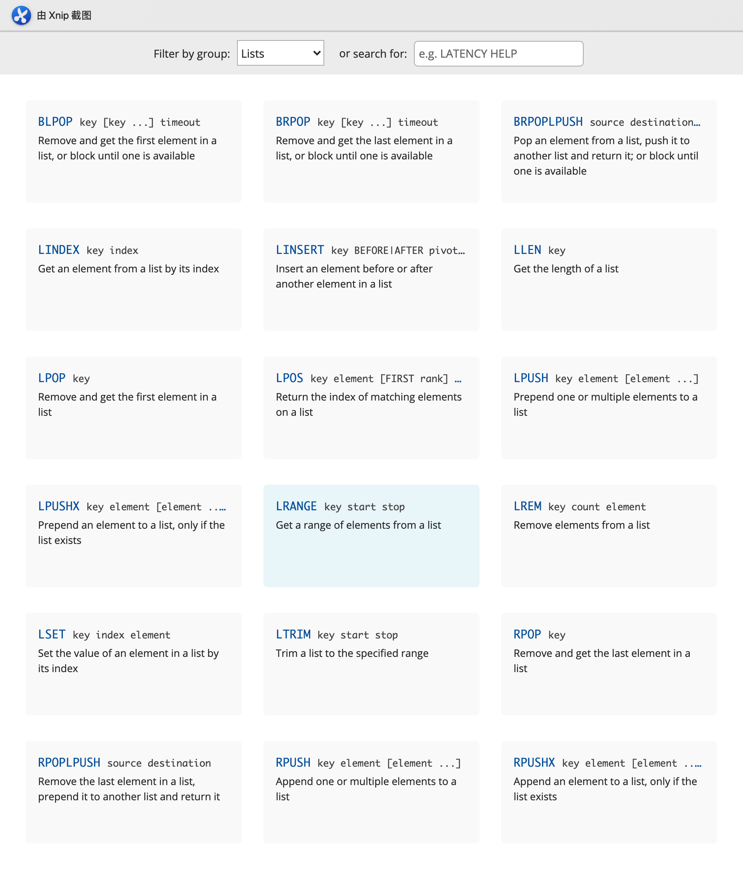
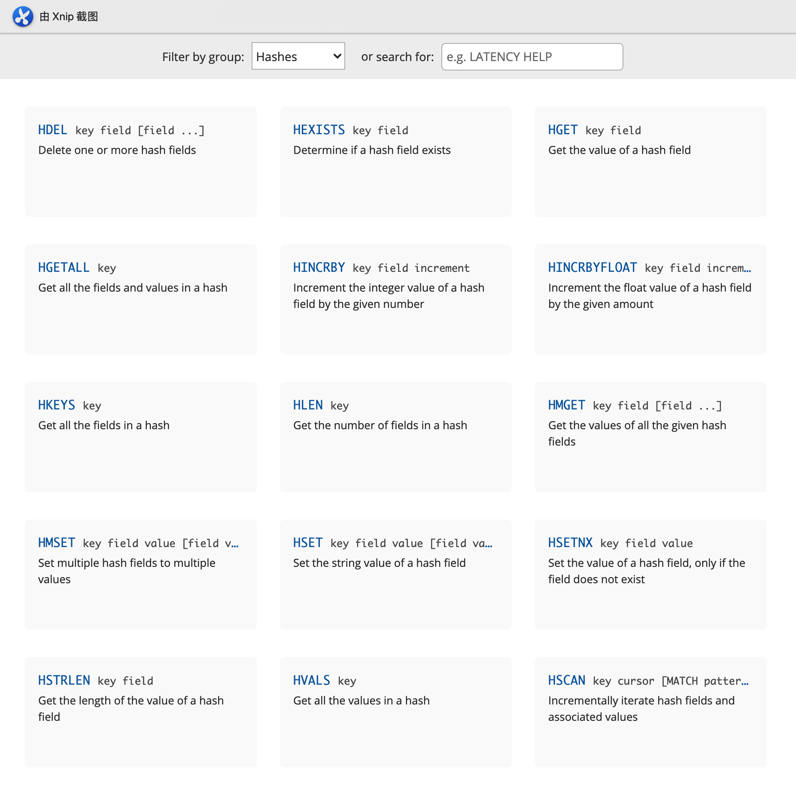
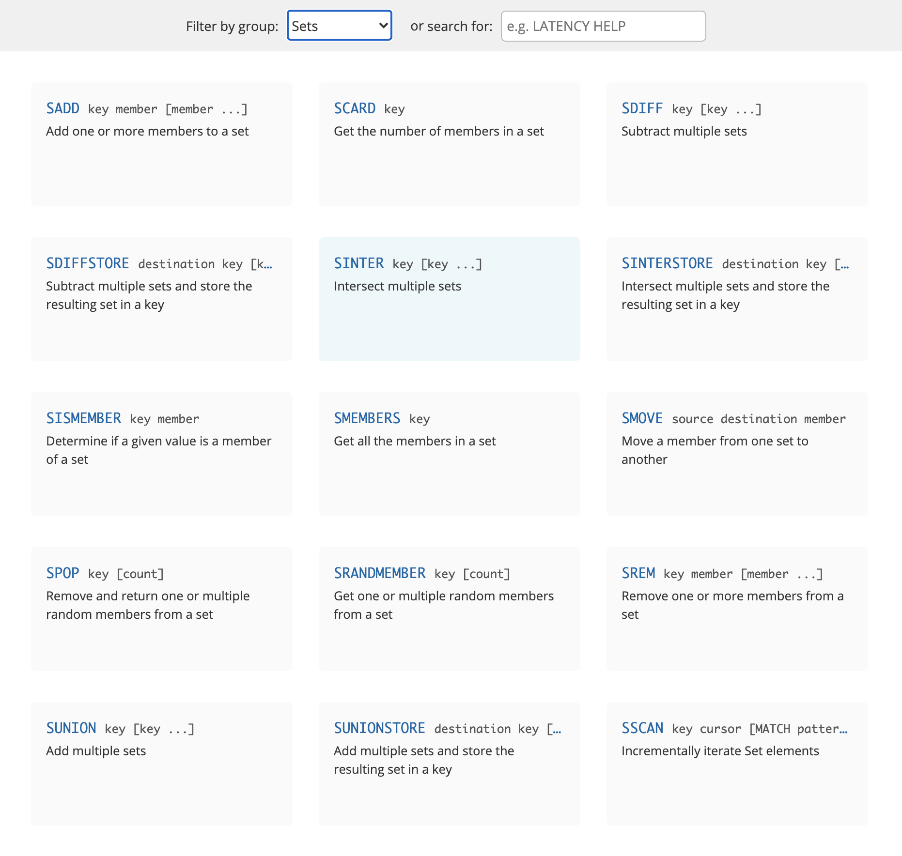

#### Redis

##### 安装

###### 步骤一：拉取镜像

```shell
~ % docker pull redis
```

###### 步骤二：创建容器

```shell
~ % # 创建redis容器，并设置密码
~ % docker run --name dev-redis -d -p 6379:6379 -v $PWD/devtools/docker/redis/data:/data redis:latest redis-server --appendonly yes --requirepass "123456"

# 创建redis容器，并挂载配置文件
~ % docker run --name dev-redis -d -p 6379:6379 -v $PWD/devtools/docker/redis/data:/data -v $PWD/devtools/docker/redis/conf/redis.conf:/etc/redis/redis.conf redis:6.2.1 redis-server --requirepass "123456"

# 进入redis容器，并且启动redis-cli
# 方法1
~ % docker exec -it [container name] or [container id] redis-cli -h 192.168.74.128 -p 6379
# 方法2
~ % docker exec -it [container name] or [container id] redis-cli

~ % docker run --name redis -d -p 6379:6379 \
	-v $PWD/devtools/docker/redis/data:/data \
	-v $PWD/devtools/docker/redis/conf/redis.conf:/etc/redis/redis.conf \
	redis:6.2.6 redis-server --requirepass "123456"

# 连接设置了密码的redis-server
127.0.0.1:6379> auth password
```

##### 测试

###### 测试命令

```shell
# 测试redis单机并发量
# 1、进入redis容器
~ % docker exec -it [container name] or [container id] /bin/bash
# 2、进入"/usr/local/bin"目录下
root@75e2c66b02df: cd /usr/local/bin
# 3、运行测试命令
# -h: 指定服务器主机名，-p: 端口号，-c: 
root@75e2c66b02df:/usr/local/bin# redis-benchmark  -h localhost -p 6379 -c 100 -n 10000
```


######【截图来自菜鸟教程】


#### 基本操作

```bash
# 1、切换数据库
127.0.0.1:6379> select 1
OK

# 2、查看数据库数据量
127.0.0.1:6379[1]> dbsize
(integer) 0

# 3、插入值
127.0.0.1:6379[1]> set name ligang
OK

# 4、通key获取值
127.0.0.1:6379[1]> get name
"ligang"

# 5、查看当前数据库中所有的key
127.0.0.1:6379[1]> keys *
1) "name"

# 6、清空当前数据库
127.0.0.1:6379[1]> flushdb
OK

# 7、清空所有数据库
127.0.0.1:6379[1]> flushall
OK
```

##### string类型的操作



##### list类型操作



##### hash类型操作



##### set类型操作



##### Redis 淘汰机制

###### 最大内存设置

​		默认情况下，在32位OS中，Redis最大使用3GB的内存，在64位OS中则没有限制。

​		在使用Redis时，应该对数据占用的最大空间有一个基本准确的预估，并为Redis设定最大使用的内存。否则在64位OS中Redis会无限制地占用内存（当物理内存被占满后会使用swap空间），容易引发各种各样的问题。

通过如下配置控制Redis使用的最大内存：

```
maxmemory 100mb
```

在内存占用达到了maxmemory后，再向Redis写入数据时，Redis会：

1. 根据配置的数据淘汰策略尝试淘汰数据，释放空间

2. 如果没有数据可以淘汰，或者没有配置数据淘汰策略，那么Redis会对所有写请求返回错误，但读请求仍然可以正常执行

3. 在为Redis设置maxmemory时，需要注意：

   ​		如果采用了Redis的主从同步，主节点向从节点同步数据时，会占用掉一部分内存空间，如果maxmemory过于接近主机的可用内存，导致数据同步时内存不足。所以设置的maxmemory不要过于接近主机可用的内存，留出一部分预留用作主从同步。

###### 数据淘汰机制

Redis提供了5种数据淘汰策略：

1. volatile-lru：使用LRU算法进行数据淘汰（淘汰上次使用时间最早的，且使用次数最少的key），只淘汰设定了有效期的key
2. allkeys-lru：使用LRU算法进行数据淘汰，所有的key都可以被淘汰
3. volatile-random：随机淘汰数据，只淘汰设定了有效期的key
4. allkeys-random：随机淘汰数据，所有的key都可以被淘汰
5. volatile-ttl：淘汰剩余有效期最短的key

​    最好为Redis指定一种有效的数据淘汰策略以配合maxmemory设置，避免在内存使用满后发生写入失败的情况。

​    一般来说，推荐使用的策略是volatile-lru，并辨识Redis中保存的数据的重要性。对于那些重要的，绝对不能丢弃的数据（如配置类数据等），应不设置有效期，这样Redis就永远不会淘汰这些数据。对于那些相对不是那么重要的，并且能够热加载的数据（比如缓存最近登录的用户信息，当在Redis中找不到时，程序会去DB中读取），可以设置上有效期，这样在内存不够时Redis就会淘汰这部分数据。

配置方法：

```
maxmemory-policy volatile-lru #默认是noeviction，即不进行数据淘汰
```

